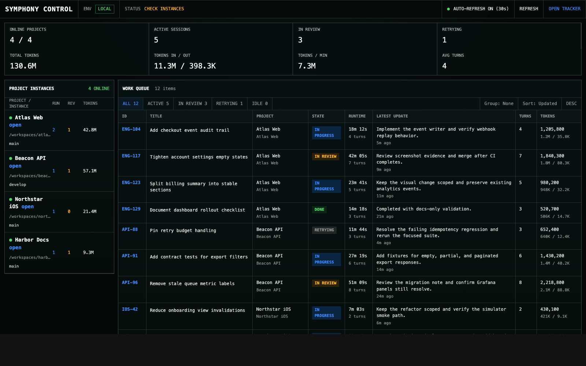

# Symphony Dashboard

A small local dashboard that rolls up multiple Symphony observability servers into one page.

**Open source under the MIT License.** Use it, fork it, modify it, and ship it in your own Symphony setup.



It is designed for teams running several Symphony instances at once. Each Symphony server keeps its own detailed dashboard and API; this project polls those local servers, aggregates active issues, and shows a single control surface for project health, running sessions, retrying work, and token usage.

## Requirements

- Node.js 20 or newer
- One or more running Symphony servers with the Phoenix observability API enabled by `--port`

## Quick Start

Run the dashboard with built-in sample data:

```bash
npm run demo
```

Then open `http://127.0.0.1:4050`.

Connect it to your own Symphony instances:

```bash
cp config/projects.example.json config/projects.json
npm run check
npm start
```

Then open `http://127.0.0.1:4050`.

Use a custom port for the rollup dashboard:

```bash
SYMPHONY_DASHBOARD_PORT=4051 npm start
```

Use a custom config file:

```bash
SYMPHONY_DASHBOARD_CONFIG=/path/to/projects.json npm start
```

## Configuration

Create `config/projects.json`:

```json
{
  "dashboard": {
    "title": "Symphony Control",
    "linearUrl": "https://linear.app",
    "refreshSeconds": 30
  },
  "projects": [
    {
      "name": "Example App",
      "port": 4000,
      "workflow": "/path/to/repo/WORKFLOW.md",
      "branch": "main"
    }
  ],
  "issues": {}
}
```

Project entries support either `port` or `url`. If `url` is omitted, the dashboard uses `http://127.0.0.1:<port>`.

The optional `issues` map lets you enrich Symphony issue IDs with display metadata such as title, Linear URL, project name, and remaining work. The dashboard still works without it.

## Commands

```bash
npm start       # run the dashboard server
npm run demo    # run sample data in watch mode for local UI edits
npm run demo:once # run sample data without file watching
npm run status  # print a terminal status rollup
npm run check   # syntax-check the Node entrypoints
```

## What It Polls

For each configured project, the dashboard requests:

- `/` to discover visible issue IDs and summary metrics
- `/api/v1/:issueId` to fetch per-issue runtime details

If a Symphony server is offline or returns an error, the project stays visible with an offline status.

## Sample Data

`config/projects.sample.json` contains realistic placeholder projects and work items. Each project can define a `sample` object with `running`, `retrying`, `totalTokens`, and `sessions`. When `sample` is present, the dashboard renders that data directly and does not call a local Symphony server.

Use it for screenshots, demos, and first-run verification:

```bash
npm run demo
```

## Local Example

For the current machine setup, copy the local example:

```bash
cp config/projects.local.example.json config/projects.json
npm start
```

Do not commit `config/projects.json`; it is ignored because it can contain private local paths.

## License

MIT. See [LICENSE](LICENSE).
